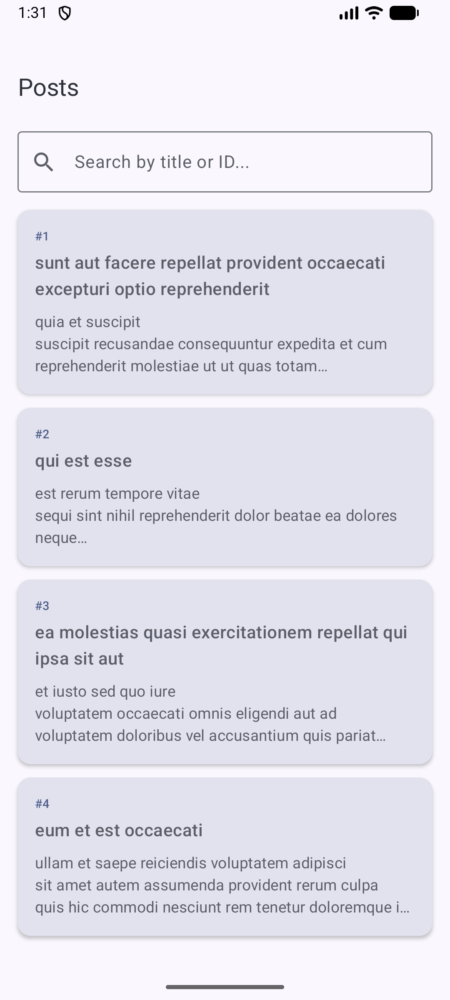
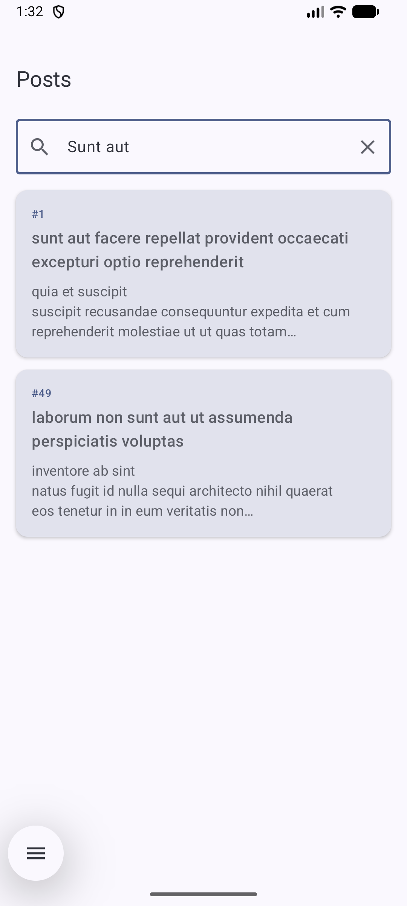
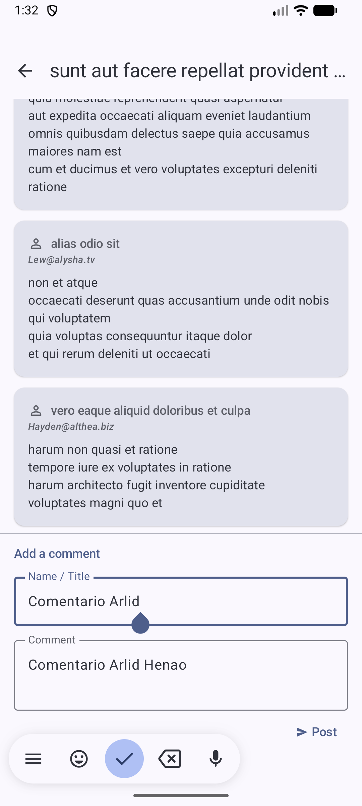
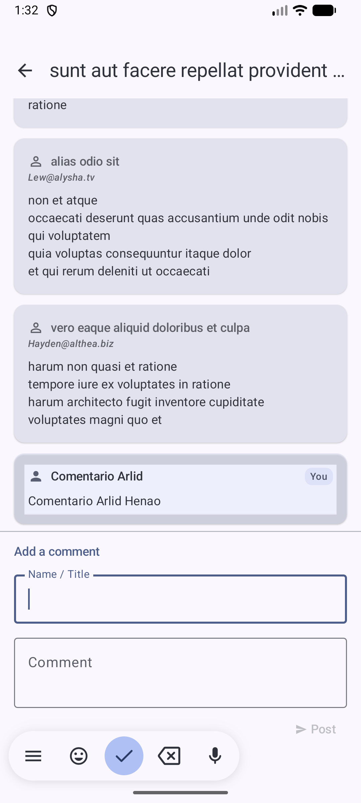

# Posts Offline App

> Aplicación Android **offline-first** para visualizar publicaciones, leer comentarios y agregar comentarios propios, incluso sin conexión a internet.

[](https://github.com/ArlidHR/posts-offline-app/actions/workflows/android-ci.yml)


---

## Tabla de contenido

1. [Screenshots de la aplicación](#-screenshots-de-la-aplicación)
2. [Explicación de la arquitectura utilizada](#-explicación-de-la-arquitectura-utilizada)
3. [Estructura del proyecto](#-estructura-del-proyecto)
4. [Librerías utilizadas y por qué](#-librerías-utilizadas-y-por-qué)
5. [Decisiones técnicas tomadas](#-decisiones-técnicas-tomadas)
6. [Cómo ejecutar el proyecto](#-cómo-ejecutar-el-proyecto)
7. [Cómo escalaría la aplicación](#-cómo-escalaría-la-aplicación)
8. [Qué mejoraría si tuviera más tiempo](#-qué-mejoraría-si-tuviera-más-tiempo)

---

## Screenshots de la aplicación

| Lista de publicaciones | Búsqueda | Comentarios | Agregar comentario |
|:---:|:---:|:---:|:---:|
|  |  |  |  |
| 100 posts cargados desde la API y guardados en Room | Búsqueda por título o ID — funciona sin conexión | Lista de comentarios con formulario sticky al fondo | Formulario con nombre y cuerpo, se guarda localmente en Room |

---

## Explicación de la arquitectura utilizada

La aplicación implementa **Clean Architecture** con el patrón de presentación **MVVM**, organizada en una **estructura modular por feature**.

```
┌─────────────────────────────────────────────────────────────────┐
│                      Capa de Presentación                        │
│   ┌──────────────┐    ┌──────────────┐    ┌──────────────────┐  │
│   │ Composables  │───▶│  ViewModel   │───▶│   UiState        │  │
│   │  (Screens)   │    │ (StateFlow)  │    │ (data class)     │  │
│   └──────────────┘    └──────┬───────┘    └──────────────────┘  │
├───────────────────────────────┼─────────────────────────────────┤
│                        Capa de Dominio                           │
│   ┌──────────────┐    ┌──────▼───────┐    ┌──────────────────┐  │
│   │  Repository  │    │   UseCase    │    │  Modelos dominio  │  │
│   │  (interface) │◀───│ (operadores) │    │  (Kotlin puro)   │  │
│   └──────────────┘    └──────────────┘    └──────────────────┘  │
├─────────────────────────────────────────────────────────────────┤
│                         Capa de Datos                            │
│   ┌──────────────┐    ┌──────────────┐    ┌──────────────────┐  │
│   │RepositoryImpl│───▶│  LocalSource │    │  RemoteSource    │  │
│   │(offline-first│    │  (Room DAO)  │    │ (Retrofit API)   │  │
│   │  strategy)   │    └──────────────┘    └──────────────────┘  │
│   └──────────────┘                                               │
└─────────────────────────────────────────────────────────────────┘
```

### Estrategia Offline-First (cache-then-network)

```
El usuario abre la pantalla
          │
          ▼
    Emitir Loading
          │
          ▼
Intento de refresh API ──── Falla ──▶ ¿Caché vacío?
          │                                │         │
        Éxito                             Sí         No
          │                                │         │
    Actualiza Room                  Emitir Error  Emitir datos
          │                                       obsoletos
          ▼
   Room re-emite             El usuario ve
   datos frescos ───────────▶  los resultados
```

**Regla clave:** Los comentarios creados localmente por el usuario (`isLocal = true`) **nunca se eliminan** durante un refresh de la API. Solo se reemplazan los comentarios obtenidos de la red.

### Flujo de datos (Unidireccional)

```
Acción del usuario ──▶ ViewModel ──▶ UseCase ──▶ Repository ──▶ Room / API
                           ▲                                          │
                           └──── StateFlow<UiState> ◀─────────────────┘
```

### Pruebas unitarias — 70 tests / 0 fallos

| Clase | Tests |
|---|---|
| `GetPostsUseCase` | 4 |
| `SearchPostsUseCase` | 5 |
| `GetPostByIdUseCase` | 4 |
| `PostRepositoryImpl` | 11 |
| `PostsViewModel` | 10 |
| `GetCommentsUseCase` | 4 |
| `AddCommentUseCase` | 7 |
| `CommentRepositoryImpl` | 6 |
| `CommentsViewModel` | 12 |
| **Total** | **70** |

### CI/CD — GitHub Actions

```
push / PR → main
      │
 ┌────┴────────────┐
🔍 lint        🧪 tests
 └────────┬─────────┘
          │
      🏗️ build APK
          │
      ✅ ci-status  ← gate requerido para merge
```

---

## Estructura del proyecto

```
app/src/main/java/com/github/arlidhr/posts_offline_app/
│
├── application/
│   ├── MainActivity.kt              # @AndroidEntryPoint — aloja el NavGraph
│   └── PostsOfflineApp.kt           # @HiltAndroidApp
│
├── core/
│   ├── di/
│   │   ├── AppModule.kt             # Room, bindings de Dispatcher
│   │   └── NetworkModule.kt         # Retrofit, OkHttp, GsonConverter
│   ├── error/
│   │   └── Result.kt                # Sealed class: Loading | Success | Error
│   ├── navigation/
│   │   ├── NavGraph.kt              # AppNavGraph composable
│   │   └── Routes.kt                # Rutas type-safe (sealed class)
│   └── utils/
│       └── Constants.kt             # BASE_URL y constantes globales
│
├── components/                      # Componentes Compose reutilizables
│   ├── EmptyState.kt
│   ├── ErrorMessage.kt
│   ├── LoadingIndicator.kt
│   └── SearchBar.kt
│
├── data/
│   └── database/
│       └── AppDatabase.kt           # Base de datos Room (posts + comments)
│
├── networking/
│   ├── ConnectivityObserver.kt      # Interface para estado de red
│   └── NetworkConnectivityObserver.kt
│
├── modules/
│   ├── posts/
│   │   ├── data/
│   │   │   ├── dao/PostDao.kt
│   │   │   ├── datasource/          # PostLocalDataSource(Impl), PostRemoteDataSource(Impl)
│   │   │   ├── entity/PostEntity.kt
│   │   │   ├── repository/PostRepositoryImpl.kt
│   │   │   └── service/PostApiService.kt
│   │   ├── di/PostsModule.kt
│   │   ├── domain/
│   │   │   ├── model/Post.kt
│   │   │   ├── repository/PostRepository.kt  # interface
│   │   │   └── usecase/             # GetPostsUseCase, SearchPostsUseCase, GetPostByIdUseCase
│   │   └── presentation/
│   │       ├── state/PostsUiState.kt
│   │       ├── view/                # PostsListScreen, PostItem
│   │       └── viewmodel/PostsViewModel.kt
│   │
│   └── comments/
│       ├── data/
│       │   ├── dao/CommentDao.kt
│       │   ├── datasource/          # CommentLocalDataSource(Impl), CommentRemoteDataSource(Impl)
│       │   ├── entity/CommentEntity.kt
│       │   ├── repository/CommentRepositoryImpl.kt
│       │   └── service/CommentApiService.kt
│       ├── di/CommentsModule.kt
│       ├── domain/
│       │   ├── model/Comment.kt
│       │   ├── repository/CommentRepository.kt  # interface
│       │   └── usecase/             # GetCommentsUseCase, AddCommentUseCase
│       └── presentation/
│           ├── state/CommentsUiState.kt
│           ├── view/                # CommentsScreen, CommentItem
│           └── viewmodel/CommentsViewModel.kt
│
└── ui/theme/                        # Material3 Color, Typography, Theme
```

---

## Librerías utilizadas y por qué

### Core

| Librería | Versión | Por qué |
|---|---|---|
| **Kotlin** | 2.2.10 | Lenguaje principal de Android; coroutines, sealed classes, extension functions |
| **Jetpack Compose** | BOM 2026.02.01 | UI declarativa — menos boilerplate, mejor gestión de estado, sin XML |
| **Material 3** | BOM | Sistema de diseño coherente con las guías modernas de Android |

### Arquitectura e Inyección de Dependencias

| Librería | Versión | Por qué |
|---|---|---|
| **Hilt** | 2.59.2 | DI estándar para Android; integración nativa con ViewModel, Navigation y WorkManager. Menos boilerplate que Dagger manual |
| **ViewModel + Lifecycle** | 2.8.7 | Sobrevive cambios de configuración; `viewModelScope` cancela coroutines automáticamente |
| **Navigation Compose** | 2.8.5 | Navegación type-safe con back-stack y soporte de Hilt |

### Persistencia

| Librería | Versión | Por qué |
|---|---|---|
| **Room** | 2.7.2 | ORM oficial de SQLite; soporte nativo de Flow para DB reactiva; validación de queries en tiempo de compilación |

### Networking

| Librería | Versión | Por qué |
|---|---|---|
| **Retrofit** | 2.11.0 | Cliente REST de facto; soporte de suspend functions; definición limpia de APIs |
| **OkHttp + Logging** | 4.12.0 | HTTP client con interceptores; interceptor de logging para debug |
| **Gson Converter** | 2.11.0 | Deserialización de JSON para respuestas de la API |

### Asincronía

| Librería | Versión | Por qué |
|---|---|---|
| **Kotlin Coroutines** | 1.9.0 | Concurrencia estructurada; Flow para streams reactivos; reemplaza RxJava con sintaxis más simple |

### Testing

| Librería | Versión | Por qué |
|---|---|---|
| **JUnit 4** | 4.13.2 | Test runner estándar para tests JVM en Android |
| **MockK** | 1.13.13 | Librería de mocking nativa de Kotlin; soporte real para funciones `suspend` |
| **Turbine** | 1.2.0 | Utilidad para testear Flows; `test { awaitItem() }` en lugar de `runBlocking + toList` |
| **kotlinx-coroutines-test** | 1.9.0 | `TestDispatcher`, `runTest`, `advanceUntilIdle` para tests deterministas de coroutines |

### Build

| Plugin | Versión | Por qué |
|---|---|---|
| **AGP** | 9.1.0 | Android Gradle Plugin |
| **KSP** | 2.2.10-2.0.2 | Kotlin Symbol Processing — más rápido que KAPT para Room y Hilt |

---

## 🔧 Decisiones técnicas tomadas

### 1. Estructura de paquetes por feature (no por capa)
**Decisión:** `modules/posts/data/`, `modules/posts/domain/`, `modules/posts/presentation/` — cada feature es dueña de todas sus capas.  
**Por qué:** Escala mejor. Agregar una nueva feature significa crear una carpeta, no tocar 4 capas horizontales. Cualquier developer sabe inmediatamente dónde vive todo lo relacionado con "posts".

### 2. Sealed class `Result<T>` en lugar de excepciones
**Decisión:** `Result.Loading | Result.Success<T> | Result.Error`  
**Por qué:** Obliga al caller a manejar todos los estados. Type-safe. Sin `try/catch` en el ViewModel. Funciona perfectamente con `when` en Compose.

### 3. Capa de abstracción DataSource entre Repository y DAO
**Decisión:** Interface `PostLocalDataSource` + `PostLocalDataSourceImpl` wrapping `PostDao`.  
**Por qué:** Los tests del Repository mockean `PostLocalDataSource`, no el DAO. No se necesita Room in-memory en tests unitarios. Una futura migración a SQLDelight (para KMP) solo requiere un nuevo `Impl`.

### 4. Comentarios locales con flag `isLocal = true`
**Decisión:** Los comentarios creados por el usuario se guardan en Room con `isLocal = true` y nunca se envían a la API.  
**Por qué:** La API (`jsonplaceholder.typicode.com`) es de solo lectura. El flag permite al Repository distinguir qué comentarios eliminar en cada refresh (solo `isLocal = false`). Los comentarios del usuario persisten indefinidamente.

### 5. Patrón `operator fun invoke()` en UseCases
**Decisión:** `class GetPostsUseCase { operator fun invoke() = ... }`  
**Por qué:** Call site limpio: `getPostsUseCase()` se lee como una función, no como `getPostsUseCase.execute()`. Sin interface necesaria — una clase, una responsabilidad.

### 6. `@IoDispatcher` inyectable en los Repositories
**Decisión:** Los repositories reciben un `CoroutineDispatcher` vía inyección marcado con `@IoDispatcher`.  
**Por qué:** Los tests inyectan `UnconfinedTestDispatcher` para saltarse el `flowOn()`. El código de producción usa `Dispatchers.IO`. Tests deterministas sin cambios de contexto.

### 7. `ForeignKey` con `CASCADE` en `CommentEntity → PostEntity`
**Decisión:** `@ForeignKey(onDelete = ForeignKey.CASCADE)` en `CommentEntity.postId`.  
**Por qué:** Integridad referencial a nivel de base de datos. Si un post se elimina (en un refresh), todos sus comentarios se eliminan automáticamente. Sin rows huérfanos.

### 8. `@PrimaryKey(autoGenerate = true)` en comentarios
**Decisión:** Comentarios locales usan `id = 0` para activar el auto-generate de SQLite.  
**Por qué:** Los comentarios de la API vienen con su propio ID. Los locales necesitan IDs que no colisionen con los de la API. SQLite genera IDs desde el ROWID disponible.

### 9. Debounce de 300ms en el SearchBar
**Decisión:** `delay(300L)` + cancelación del job anterior en `onSearchQueryChange`.  
**Por qué:** Evita una consulta a la base de datos por cada pulsación de tecla. El job se cancela si el usuario escribe dentro de 300ms; solo la query final llega a Room.

### 10. Job aggregador `ci-status` como único check requerido en CI
**Decisión:** Un job final agrega el resultado de lint + test + build como único check de branch protection.  
**Por qué:** GitHub branch protection requiere una lista fija de checks. Si se agregan lint/test/build como checks individuales, agregar un nuevo job rompe la branch protection. El patrón aggregador permite añadir y remover jobs libremente.

---

## Cómo ejecutar el proyecto

### Requisitos previos

| Herramienta | Versión |
|---|---|
| Android Studio | Hedgehog 2023.1.1+ (o más reciente) |
| JDK | 17 (Temurin recomendado) |
| Android SDK | API 35 (compileSdk) |
| Dispositivo / emulador mínimo | API 24 (Android 7.0) |

### Pasos

```bash
# 1. Clonar el repositorio
git clone https://github.com/ArlidHR/posts-offline-app.git
cd posts-offline-app

# 2. Abrir en Android Studio
# File → Open → seleccionar la carpeta del proyecto

# 3. Sincronizar Gradle
# Android Studio lo pedirá automáticamente

# 4. Ejecutar la app
# Seleccionar dispositivo / emulador → Presionar ▶ Run
```

Por línea de comandos:
```bash
# Compilar APK de debug
./gradlew assembleDebug
# APK en: app/build/outputs/apk/debug/app-debug.apk

# Instalar en dispositivo conectado
./gradlew installDebug
```

### Ejecutar los tests

```bash
# Todos los tests unitarios
./gradlew testDebugUnitTest

# Reporte HTML en:
# app/build/reports/tests/testDebugUnitTest/index.html

# Test de una clase específica
./gradlew testDebugUnitTest --tests "*.PostsViewModelTest"
```

> **Nota:** Se necesita internet en el **primer lanzamiento** para poblar la base de datos local. Después, la app funciona completamente offline. Posts y comentarios persisten entre reinicios del dispositivo.

---

## Cómo escalaría la aplicación

### 1. Kotlin Multiplatform (KMP)
Reemplazar las implementaciones de `PostLocalDataSource` con **SQLDelight** (SQL multiplataforma) y `PostRemoteDataSource` con **Ktor** (HTTP client multiplataforma). Las capas de dominio y presentación ya son Kotlin puro — no necesitarían cambios.

### 2. Modularización por feature en Gradle
Convertir cada feature en un módulo Gradle independiente:
```
:app
:feature:posts
:feature:comments
:core:network
:core:database
:core:ui
```
Beneficios: builds incrementales más rápidos, fronteras de dependencia explícitas, compilación paralela.

### 3. Paginación con Jetpack Paging 3
Reemplazar `List<Post>` con `PagingData<Post>`. La API de JSONPlaceholder retorna 100 posts; backends reales pueden retornar miles.

### 4. Sincronización en background con WorkManager
Usar `WorkManager` para sincronizar posts en segundo plano (incluso con la app cerrada) de forma periódica o cuando se restaure la conexión.

### 5. CI multi-módulo
A medida que el proyecto crece, agregar `--module-check` en Gradle para solo recompilar y testear los módulos modificados, reduciendo drásticamente el tiempo del pipeline.

### 6. Crash reporting y analíticas
Agregar **Firebase Crashlytics** para tracking de crashes en producción y **Firebase Analytics** para comportamiento de usuario — ambos inyectables con Hilt.

---

## Qué mejoraría si tuviera más tiempo

| Prioridad | Mejora | Razón |
|---|---|---|
| **Alta** | **Reporte de cobertura con Jacoco** en CI | Aplicar cobertura mínima (ej. 80%) como quality gate |
| **Alta** | **Tests instrumentados / UI** con Compose Testing | Verificación end-to-end de que las pantallas renderizan correctamente |
| **Alta** | **Retry con exponential backoff** | Las apps de producción necesitan resiliencia ante fallos de red intermitentes |
| **Media** | **Tests de DAO con Room in-memory** | Validar queries SQL complejas (búsqueda LIKE, CASCADE deletes) |
| **Media** | **Pull-to-refresh** con gesto | Más intuitivo que el auto-refresh al abrir la pantalla |
| **Media** | **Paginación** (Paging 3) | Mejor UX y memoria para conjuntos de datos grandes |
| **Media** | **Modo oscuro** | El theming de Material 3 ya lo soporta; solo requiere revisión de color tokens |
| **Baja** | **Migración a Kotlin Multiplatform** | Gran alcance, pero la abstracción de DataSource ya está diseñada para ello |
| **Baja** | **Banner de estado offline** | Mostrar un banner no intrusivo cuando no hay conexión (ConnectivityObserver ya implementado) |
| **Baja** | **Pantalla de detalle del post** | Pantalla dedicada con el cuerpo completo del post antes de listar los comentarios |

---

## Autor

**ArlidHR** · [GitHub](https://github.com/ArlidHR)

*Desarrollado como prueba técnica demostrando Clean Architecture, patrones offline-first y desarrollo Android moderno.*

---

*Kotlin 2.2.10 · Jetpack Compose · Clean Architecture · Hilt · Room · Retrofit · Coroutines*
